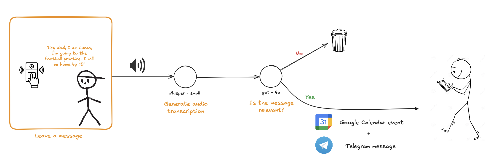

# Sneak Peek - LauzHack 2025


This project leverages **state-of-the-art visual language models** (QWEN2-VL) and **agentic frameworks** (LangGraph) to monitor a home in real time. The system can:

- Detect people approaching the door and classify them as **residents**, **routine visitors** (e.g., mail carriers), or **suspicious activities**.  
- Convert **voice inputs** into Google Calendar events using **Whisper** and a small **LLM**, tracking expected return times.  
- Send **Telegram alerts** for both:  
  - People approaching the door, and  
  - Missed deadlines when a resident has not returned as expected.  

Our MVP simulates the doorbell of a house,...


  - web UI + telegram en la misma pantalla o cambiar de pantalla? (para no tener que lidiar con la web en media pantalla)

The features of our system are the following:
## 1. Real-time notification based on user preferences

### 1.1 User-defined preferences 
Our system continuously monitors your house entrance, starting to record short video clips of (X) seconds whenever it detects movement. The VLM model, named Qwen2-VL, assesses each recording's relevance according to your defined criteria; for instance, you might be interested only in receiving notifications when the mailman leaves a package at the front door.

### 1.2 Real-time Telegram notification
Once a recording is deemed relevant by the model, we will promptly notify you via Telegram and enable access to view the recorded clip.

### 1.3 Face recognition of commonly seen people 

You can also provide photographs of specific individuals that our system should recognize easily, and will be tagged as "family" members. An example use for that is wanting to receive notifications every time your 12-year-old child enters or exits your home. 


- (in case of suspicious activity we will call you?)


## 2. Creation of events using voice statements

### 2.1 Audio message recording
Picture the mailman leaving a package at your front door or your daughter departing; our system will capture these moments by letting them record audio messages. 

### 2.2 Creation of Google Calendar events
The system has the capability to automatically generate Google Events and Telegram notifications based on these messages, ensuring you have real-time access to all pertinent information related to your home through frequently used apps like Google Calendar and Telegram.



## Set-up

1. Install [FFmpeg](https://www.ffmpeg.org/download.html)
2. Create a conda environment using the provided .yaml and activate it.
```bash
conda env create -f environment.yml
```
3. Follow the [Python quickstart](https://developers.google.com/workspace/calendar/api/quickstart/python) to set up the environment, and save the generated `credentials.json` (and later `token.json`) from Google Cloud. Place both files in the root folder of the project.

4. Set-up an agent in the Telegram app, follow the first step of [this Medium tutorial](https://medium.com/@moraneus/building-telegram-bot-with-python-telegram-bot-a-comprehensive-guide-7e33f014dc79), and save the generated token for later.

HOW to get the chat id!!! (second step of the tutorial, mini script?)

5. Create an inference endpoint in Hugging Face with [Whisper](https://huggingface.co/openai/whisper-small) (ASR model) and save the endpoint URL for later.
6. Generate Hugging Face and OpenAI tokens
5. Create a .env file with the following environment variables defined:
```env
TELEGRAM_TOKEN = <token>
TELEGRAM_CHAT_ID = <id>
HF_TOKEN = <token>
OPENAI_API_KEY = <token>
WHISPER_ENDPOINT = <URL>
```
### Further imporvements
- Automatic speaker recognition for the creation of events
### Authors
- Maria Gil
- Lola Monroy Mir
- Iván Hernández Gómez
(link to their linkedins?)