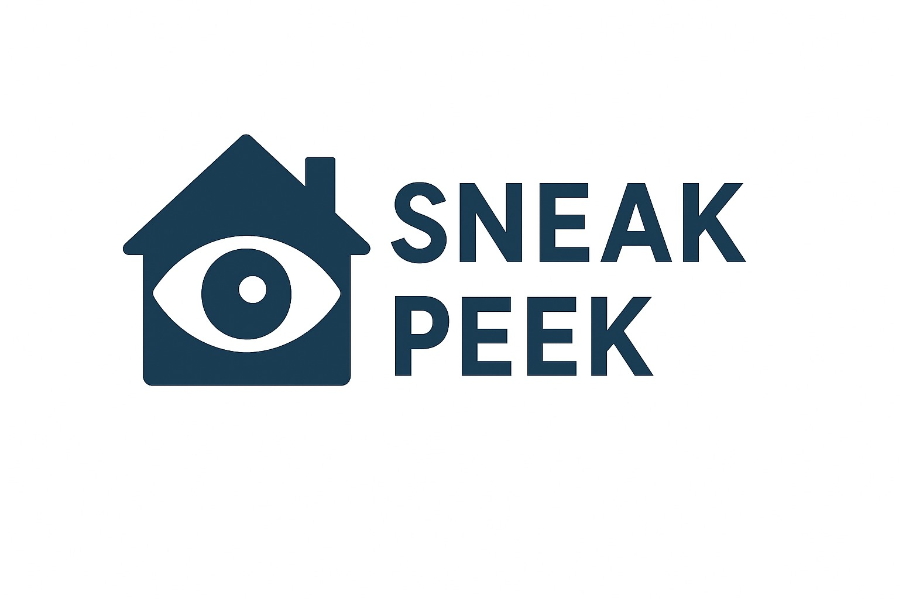

# Sneak Peek - LauzHack 2025



This project leverages **state-of-the-art visual language models** (QWEN2-VL) and **agentic frameworks** (LangGraph) to monitor a home in real time. The system can:

- Detect people approaching the door and classify them as **residents**, **routine visitors** (e.g., mail carriers), or **suspicious activities**.  
- Convert **voice inputs** into Google Calendar events using **Whisper** and a small **LLM**, tracking expected return times.  
- Send **Telegram alerts** for both:  
  - People approaching the door, and  
  - Missed deadlines when a resident has not returned as expected.  

Our MVP simulates the doorbell of a house,...

  VIDEO DEMOOOOOOOOOOOOOO
  - web UI + telegram en la misma pantalla o cambiar de pantalla? (para no tener que lidiar con la web en media pantalla)


## Real-time relevant events notification
- our system continously captures the frontdoor of your house, and starts recording (X) seconds clips when some movement is detected.
- a VLM (Qwen2-VL) classifies if the recording is relevant based on your criteria (e.g im only interested when the mailman leaves a package on my frontdoor)
- we also let you upload pictures of people so the model can easily identify them, e.g i want to know everytime my 12 year old child enters or leaves home
- once a recording is classified as relevant, we will notify you via telegram, and allow you to access the recorded clip
- (in case of suspicious activity we will call you?)


## Creation of events using voice statements
- imagine the mailman leaves a package at your front door, or your daughter leaves home and they want you to know


## Set-up

1. Install [FFmpeg](https://www.ffmpeg.org/download.html)
2. Create a conda environment using the provided .yaml and activate it.
```bash
conda env create -f environment.yml
```
3. Follow the [Python quickstart](https://developers.google.com/workspace/calendar/api/quickstart/python) to set up the environment, and save the generated `credentials.json` (and later `token.json`) from Google Cloud. Place both files in the root folder of the project.

4. Set-up an agent in the Telegram app, follow the first step of [this Medium tutorial](https://medium.com/@moraneus/building-telegram-bot-with-python-telegram-bot-a-comprehensive-guide-7e33f014dc79), and save the generated token for later.

HOW to get the chat id!!! (second step of the tutorial, mini script?)

5. Create an inference endpoint in Hugging Face with [Whisper](https://huggingface.co/openai/whisper-small) (ASR model) and save the endpoint URL for later.
6. Generate Hugging Face and OpenAI tokens
5. Create a .env file with the following environment variables defined:
```env
TELEGRAM_TOKEN = <token>
TELEGRAM_CHAT_ID = <id>
HF_TOKEN = <token>
OPENAI_API_KEY = <token>
WHISPER_ENDPOINT = <URL>
```
### Further imporvements
- Automatic speaker recognition for the creation of events
### Authors
- Maria Gil
- Lola Monroy
- Iván Hernández